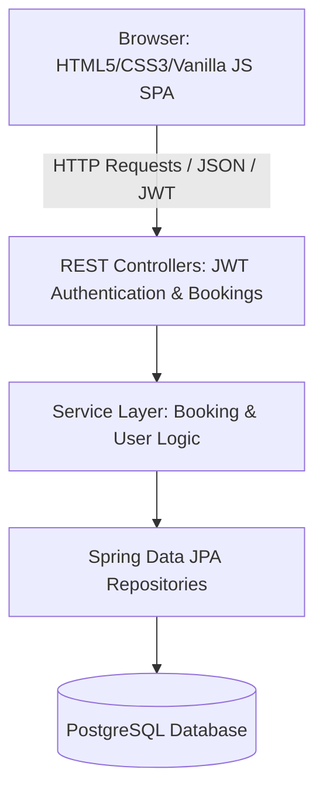

# BusEase - Premium Bus Booking & Reservation System
## Project Documentation & Setup Guide

BusEase is a premium, single-page web application (SPA) built using **Spring Boot 3.3.0** for the REST API, **Spring Security with JWT** for authentication, **Spring Data JPA** with **PostgreSQL** for persistence, and **Vanilla HTML5/CSS3/JS** for a responsive, modern frontend inspired by redBus and MakeMyTrip.

---

## 🗺️ 1. Project Architecture

The application follows a standard layered architecture for security, logic separation, and ease of deployment:



### Backend Layers:
* **Controllers**: Handles endpoints such as `/api/auth/*` (Login, Registration, Social Auth validation) and `/api/bookings/*` (Creating bookings, downloading user tickets, processing admin stats).
* **Services**: Encapsulates core business processes (e.g., ticket calculations, coupon deductions, validating seat availability).
* **Repositories**: Extends `JpaRepository` for relational database operations on PostgreSQL.
* **Security & JWT**: Intercepts requests to validate tokens using a custom BCrypt/JWT filter (`JwtAuthenticationFilter`), separating Admin APIs (`/api/admin/**`) from standard Customer APIs.

### Frontend Layers:
* **`index.html`**: Structured using Semantic HTML5 elements and layout containers.
* **`style.css`**: Built with CSS variables, responsive grids, transitions, glassmorphism filters, and redBus-inspired SVG layouts.
* **`app.js`**: Handles client-side routing (SPA view switches), form validations, interactive seating deck drawing, session handling, state management, and API integrations.

---

## 🌟 2. Core System Features

### 👤 2.1 Interactive Seating Map
- Custom redBus-style seater (`.seat-box`) and sleeper (`.seat-box.sleeper-seat`) visual rendering.
- Seaters feature realistic rounded edges and right-hand headrest notches; sleepers display pillow graphics.
- Color codes map seat states dynamically:
  - **White / Grey Border**: Available
  - **Solid Red**: Currently Selected
  - **Muted Grey**: Booked/Unavailable

### 💳 2.2 Payment Gateway Simulation
- Secure checkout process with flexible methods: Credit/Debit Card inputs, UPI QR code generation, Net Banking list, and Wallets.
- Live billing breakdown calculation including base fare, GST (18%), booking fees, and promo code discounts.

### 🛡️ 2.3 Prebooking Engine
- Gives customers the flexibility to lock their seats by paying a small reservation fee of **₹99** upfront.
- Calculates and logs the remaining balance (`Payable Later`) to be collected by the driver during boarding.

### 🎟️ 2.4 Promo Code System
- Includes backend and frontend coupon validators for:
  - **`FIRSTBUS`**: 15% discount off the base fare.
  - **`BUSEASE10`**: 10% discount off the base fare.
  - **`SAVE150`**: Flat ₹150 discount on the order.

### 📊 2.5 Admin Control Panel
- Dashboard displaying key metrics: total revenue collected, active bookings count, total registered users, and active fleet size.
- Real-time management tables showing customer credentials, feedback ratings (1-5 stars), and detailed bus occupancy charts.

### 🤖 2.6 Live Chat Support Bot
- Floating assistant widget utilizing typing micro-animations.
- Instantly processes user text searches and returns helpful answers regarding refunds, cancellations, and prebooking.

---

## 🛠️ 3. Issues Resolved

During development, we resolved several configuration and styling issues to complete the application:

1. **Port Mismatch Resolution**: Changed application port from conflicting `8081` to `8080` in `application.properties` to ensure the project runs seamlessly on `http://localhost:8080/` as documented.
2. **Social Login Icon Visibility**: Updated Apple OAuth button to remove white style overrides, explicitly coloring the SVG path fill `#000000` (black) so it displays clearly on white button backgrounds.
3. **Emoji to Google Symbols Upgrade**: Replaced basic emojis in the "Why Book" section with vector Material Symbols (`flash_on`, `security`, `confirmation_number`). Configured style settings to support colored fills (Gold, Light Sea Green, and Crimson).
4. **Unified Coupon Keys**: Renamed all promo references from `BHARAT10` to `BUSEASE10` in both `app.js` and `BookingService.java` to prevent backend validation errors.

---

## 💻 4. Local Run Instructions

Follow these steps to build and launch BusEase locally:

### 4.1 Prerequisites
Ensure the following are installed:
- **Java JDK 17** (or higher)
- **PostgreSQL Database Server**
- Maven wrapper is pre-configured in the project (`mvnw.cmd` / `mvnw`).

### 4.2 Database Configuration
1. Open your PostgreSQL terminal/management client (pgAdmin, DBeaver, etc.).
<!-- 2. Execute the database creation command: -->
   ```sql
   CREATE DATABASE bus_booking;
   ```
3. Verify connection credentials in [application.properties](src/main/resources/application.properties):
   ```properties
   spring.datasource.url=jdbc:postgresql://localhost:5432/bus_booking
   spring.datasource.username=postgres
   spring.datasource.password=root
   ```
   *(Update username or password properties if your local PostgreSQL setup uses different credentials)*.

### 4.3 Building and Running the Server
1. Open a terminal in the root of the project directory.
2. Run the startup script:
   - **Windows (CMD/PowerShell)**:
     ```cmd
     .\mvnw.cmd spring-boot:run
     ```
   - **macOS / Linux**:
     ```bash
     chmod +x mvnw
     ./mvnw spring-boot:run
     ```
3. Wait for the terminal to print:
   `Tomcat started on port 8080 (http) with context path '/'`
   `Started BusBookingApplication in ... seconds`
4. Access the web app in your browser at:
   👉 **[http://localhost:8080/](http://localhost:8080/)**

### 🔑 Preseeded Testing Accounts
Use these preseeded login details to test the core roles:
- **Customer Portal**:
  - Email: `john@gmail.com`
  - Password: `password123`
- **Admin Dashboard**:
  - Email: `admin@busbooking.com`
  - Password: `admin123` *(Provides access to the "Admin Portal" link in the top nav)*.

---

## 🐙 5. GitHub Deployment Guide

Follow these git instructions to upload and deploy your project code to GitHub:

### 5.1 Initialize Git
If you haven't initialized git in this directory yet, open your terminal and run:
```bash
git init
```

### 5.2 Add .gitignore
Create a file named `.gitignore` in the project root to exclude target compilation outputs and config folders. Add the following rules:
```text
/target/
/.mvn/wrapper/
/mvnw
/mvnw.cmd
/.idea/
/.vscode/
*.class
*.jar
*.war
.DS_Store
```

### 5.3 Commit Code
Stage and commit your local project workspace:
```bash
git add .
git commit -m "Initial commit: Complete BusEase Web Booking System codebase"
```

### 5.4 Push to GitHub
1. Go to [GitHub.com](https://github.com/) and create a new repository (name it `busease-bus-booking`). **Leave "Initialize this repository with" unchecked** (no README, no .gitignore).
2. Copy the remote URL from your repository page.
3. Link your local project to GitHub and push:
```bash
git branch -M main
git remote add origin YOUR_GITHUB_REPOSITORY_URL
git push -u origin main
```

---

